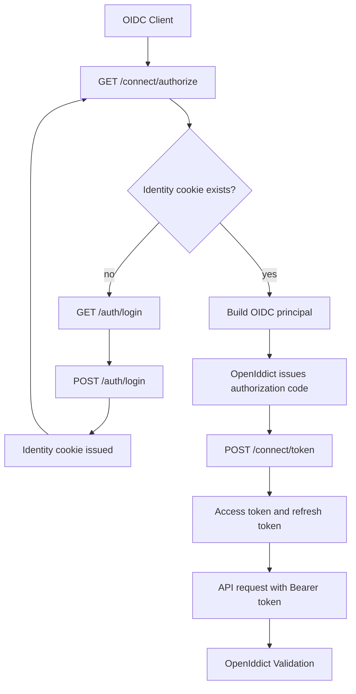
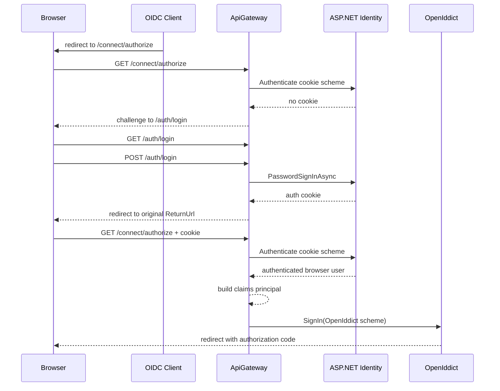
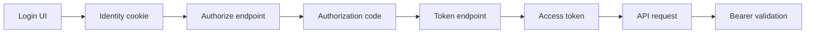

# Auth Flow

Ten dokument opisuje stan po wdrozeniu kroku 4.

Najwazniejsze rozroznienie:
- krok 2 skonfigurowal Identity + OpenIddict,
- krok 3 dodal account UI i interaktywny browser flow,
- krok 4 zarejestrowal docelowego klienta SPA w runtime aplikacji.

## 1. Co jest gotowe po kroku 4

Po kroku 4 mamy gotowe:
- Identity store userow i hasel,
- cookie auth dla browser session,
- widoki Razor dla login/register/forbidden,
- endpoint `POST /auth/logout`,
- discovery endpoint,
- token endpoint obslugiwany przez OpenIddict,
- cienka obsluge `/connect/authorize` i `/connect/logout`,
- serwis budujacy principal OIDC z usera Identity,
- runtime registration klienta SPA z konfiguracji,
- validation bearer tokenow po stronie API.

## 2. Warstwy i odpowiedzialnosci

Wazne doprecyzowanie:
- fizycznie masz jeden host: `GuitarStore.ApiGateway`,
- logicznie ten host robi dwie rozne rzeczy:
  - jest authorization serverem dla `/auth/*` i `/connect/*`,
  - jest resource API dla endpointow biznesowych.

Dlatego w dalszej czesci:
- "auth server" oznacza logowanie, sesje browsera i wydawanie tokenow,
- "resource API" oznacza endpointy biznesowe, ktore sa wywolywane z bearer tokenem.

### Identity
- user store
- hasla
- lockout
- cookie auth
- `UserManager` i `SignInManager`

### Account UI w ApiGateway
- formularz login
- formularz register
- logout browser session
- ekran forbidden

### OpenIddict Server
- discovery metadata
- authorize/token/logout protocol engine
- wydawanie authorization code i tokenow

### OpenIddict Validation
- walidacja bearer tokenow dla API

## 3. Browser flow po kroku 3

### 3.1 Start authorize flow

Klient OIDC robi redirect na:
- `GET /connect/authorize?...`

### 3.2 Brak cookie

Kontroler authorize:
- probuje odczytac cookie Identity,
- jesli go nie ma, robi challenge na cookie scheme,
- przegladarka trafia na `/auth/login?ReturnUrl=...`.

### 3.3 Login UI

User laduje:
- `GET /auth/login`

Potem wysyla:
- `POST /auth/login`

Przy sukcesie:
- Identity wystawia cookie,
- backend robi redirect do `ReturnUrl`,
- czyli z powrotem do `/connect/authorize?...`.

### 3.4 Powrot na authorize

Przy kolejnym wejsciu na `/connect/authorize`:
- cookie jest juz obecne,
- kontroler pobiera usera,
- buduje principal OIDC w osobnym serwisie,
- wywoluje `SignIn(..., OpenIddictServerAspNetCoreDefaults.AuthenticationScheme)`.

Wtedy OpenIddict:
- konczy authorize flow,
- wydaje authorization code,
- redirectuje do klienta.

### 3.5 Wymiana code na tokeny

Klient wysyla:
- `POST /connect/token`

OpenIddict:
- waliduje code,
- waliduje PKCE,
- zwraca access token i ewentualnie refresh token.

Wazne:
- to nie dzieje sie na podstawie samego cookie,
- cookie tylko pozwala przejsc browser authorize flow,
- access token wynika z poprawnego `authorization_code` i `code_verifier` na `/connect/token`.

### 3.6 API request

Klient uzywa:
- `Authorization: Bearer <access_token>`

OpenIddict Validation:
- sprawdza token,
- odtwarza `HttpContext.User`,
- pozwala `[Authorize]` dzialac po stronie API.

## 4. Diagram high-level

## 5. Diagram szczegolowy dla authorize

## 6. Diagram cookie vs bearer

## 7. Rejestracja usera w kroku 3

`POST /auth/register`:
- tworzy usera Auth,
- ustawia `UserName = Email`,
- od razu loguje usera do cookie,
- moze odeslac z powrotem do `ReturnUrl`.

To jeszcze nie robi:
- Customers integration,
- Name/LastName enrichment,
- role seeding.

## 8. Discovery i token endpoint

Discovery i `/connect/token` nadal nie wymagaja naszego kontrolera.

OpenIddict sam:
- publikuje metadata,
- waliduje requesty protokolowe,
- wystawia odpowiedzi tokenowe.

Nasza logika wchodzi tylko tam, gdzie potrzebna jest interakcja browser + cookie.

Skad to wiadomo w konfiguracji:
- `SetTokenEndpointUris("/connect/token")` rejestruje endpoint,
- brak `EnableTokenEndpointPassthrough()` oznacza, ze token endpoint nie trafia do naszego kontrolera,
- `EnableAuthorizationEndpointPassthrough()` oznacza odwrotna decyzje dla `/connect/authorize`: request ma trafic dalej do MVC.

## 9. Dokladny request/response chain

### 9.1 Browser -> authorize

Klient OIDC wysyla browser na:

`GET /connect/authorize?client_id=...&redirect_uri=...&response_type=code&scope=openid%20profile%20offline_access&code_challenge=...&code_challenge_method=S256&state=...&nonce=...`

To jest front-channel request OIDC.

### 9.2 Authorize sprawdza cookie

`OpenIddictController.Authorize()`:
- pobiera request OIDC z `HttpContext.GetOpenIddictServerRequest()`,
- probuje uwierzytelnic browser po `IdentityConstants.ApplicationScheme`.

Jesli cookie nie ma:
- `Challenge(...)` na cookie scheme,
- redirect do `/auth/login?ReturnUrl=...`.

### 9.3 Login wystawia cookie

`POST /auth/login`:
- waliduje dane,
- wywoluje `SignInManager.PasswordSignInAsync(...)`,
- Identity zapisuje cookie browser session,
- odpowiedz robi redirect do pierwotnego `ReturnUrl`.

### 9.4 Browser wraca na authorize

Drugie wejscie na `/connect/authorize?...` ma juz cookie.

Kontroler:
- pobiera usera z `UserManager`,
- sprawdza `CanSignInAsync(...)`,
- buduje principal OIDC,
- zwraca `SignIn(principal, OpenIddictServerAspNetCoreDefaults.AuthenticationScheme)`.

### 9.5 OpenIddict wydaje authorization code

Po `SignIn(...)` OpenIddict:
- zapisuje dane autoryzacyjne potrzebne przez flow,
- generuje authorization code,
- zwraca redirect do `redirect_uri` klienta z `code` i `state`.

Ten code:
- jest krotkozyjacy,
- jest jednorazowy,
- nie jest cookie,
- nie jest JWT.

### 9.6 Client -> token endpoint

Potem klient wysyla:

`POST /connect/token`

z:
- `grant_type=authorization_code`
- `code=...`
- `redirect_uri=...`
- `client_id=...`
- `code_verifier=...`

To jest back-channel albo token-channel request.

### 9.7 OpenIddict wydaje tokeny

OpenIddict:
- sprawdza, czy code istnieje i nie zostal zuzyty,
- sprawdza zgodnosc `redirect_uri`,
- sprawdza PKCE (`code_verifier` vs `code_challenge`),
- wystawia access token,
- moze wystawic refresh token,
- moze wystawic id token, zaleznie od flow i scopes.

### 9.8 API korzysta tylko z bearer tokena

Potem klient wysyla:

`Authorization: Bearer <access_token>`

OpenIddict Validation:
- waliduje token,
- odtwarza `HttpContext.User`,
- pozwala `[Authorize]` dzialac po stronie API.

## 10. Jak claims trafiaja do tokenow

Budowa principal odbywa sie w `OidcClaimsPrincipalFactory`.

Najpierw:
- `SignInManager.CreateUserPrincipalAsync(user)` tworzy principal z Identity.

Potem dopisywane sa jawnie:
- `sub`
- `email`
- `name`
- `preferred_username`

Potem:
- `principal.SetScopes(request.GetScopes())`
- `principal.SetDestinations(GetDestinations)`

To oznacza:
- scopes sa brane z requestu `/connect/authorize`,
- destinations mowia, ktore claimy maja trafic do ktorego tokena.

Aktualne zasady:
- `sub` trafia do access tokena i id tokena,
- `name`, `preferred_username`, `role` trafiaja do access tokena, a do id tokena tylko przy `profile`,
- `email` trafia do access tokena,
- `AspNet.Identity.SecurityStamp` nie trafia do tokenow.

Wniosek:
- JWT nie jest generowany z samego cookie,
- JWT jest generowany przez OpenIddict na podstawie principal przekazanego przez `SignIn(...)`.

## 11. Czy authorization code jest potrzebny

W tym ukladzie tak.

Powody:
- cookie nalezy do browser session na auth serverze,
- authorization code nalezy do standardowego OIDC flow dla konkretnego klienta i konkretnego `redirect_uri`,
- access token nalezy do warstwy API i bearer auth.

Cookie nie rozwiazuje tego samego problemu co authorization code.

Cookie mówi:
- browser ma sesje na authorization serverze.

Authorization code mówi:
- konkretny klient poprawnie przeszedl authorize flow i moze sprobowac wymiany na token.

Access token mówi:
- klient moze wywolywac API.

### Czy mozna "po loginie od razu wydac token"?

Technicznie da sie zrobic niestandardowy endpoint, ale:
- nie bylby to standardowy Authorization Code Flow,
- tracisz naturalne miejsce na PKCE i wymiane code -> token,
- mieszasz browser session z issuingiem bearer tokenow,
- slabiej pasuje do public client / SPA.

Dlatego w obecnym modelu:
- login wystawia cookie,
- authorize wykorzystuje cookie i wydaje code,
- token endpoint zamienia code na tokeny.

## 12. Tabela rozroznien

| Artefakt | Kto wystawia | Gdzie zyje | Rola | Czy sluzy do API |
| --- | --- | --- | --- | --- |
| Identity cookie | ASP.NET Core Identity | Browser i auth server | Sesja browserowa po loginie | Nie |
| Authorization code | OpenIddict | Krotkotrwaly artefakt redirect flow | Jednorazowa wymiana na tokeny | Nie |
| Access token | OpenIddict | Client aplikacyjny | Bearer auth do API | Tak |
| Refresh token | OpenIddict | Client aplikacyjny | Odnowienie access tokena | Nie bezposrednio |
| ID token | OpenIddict | Client aplikacyjny | Potwierdzenie uwierzytelnienia dla klienta OIDC | Nie |

Co znaczy "Czy sluzy do API":
- nie chodzi o to, czy request przychodzi do hosta `GuitarStore.ApiGateway`,
- bo wszystkie requesty przychodza do tego samego hosta,
- chodzi o to, czy dany artefakt sluzy do wywolywania endpointow biznesowych resource API.

Przyklady:
- cookie jest wysylane do browser/auth endpointow jak `/auth/login` i `/connect/authorize`,
- authorization code jest wysylany do `/connect/token`,
- refresh token jest wysylany do `/connect/token`,
- access token jest wysylany jako `Authorization: Bearer ...` do endpointow biznesowych.

## 13. Co zostaje na kolejne kroki

Po kroku 4 nadal zostaje:
- krok 5: role i policies,
- krok 6: Customers integration,
- krok 7: seed admin,
- krok 8: szersze testy auth code flow i refresh rotation.
