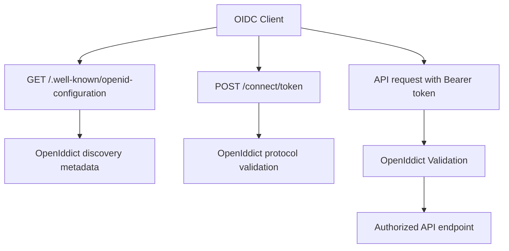
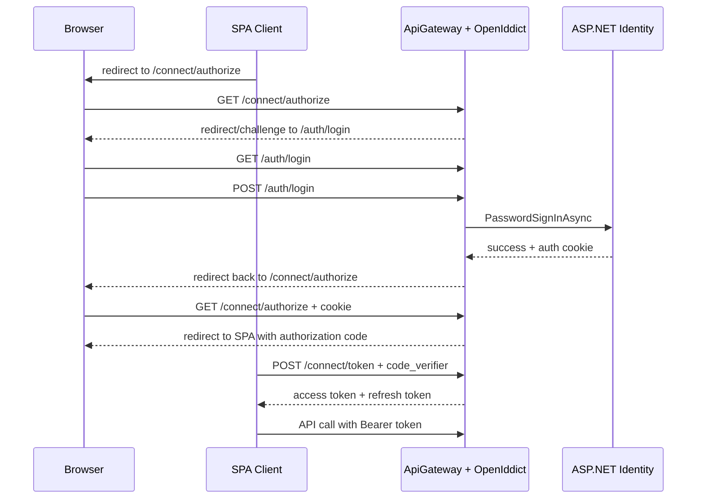
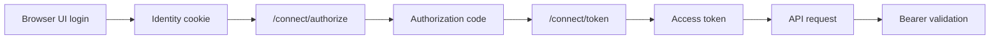

# Auth Flow

Ten dokument opisuje aktualny stan flow po poprawnym, czystym kroku 2.

Najwazniejsze rozroznienie:
- krok 2 konfiguruje Identity + OpenIddict,
- krok 3 dopiero dodaje browser UI i pelny account flow.

Dlatego ponizej sa dwa obrazy systemu:
- co dziala juz teraz,
- co zostanie dopiete w kroku 3 i kolejnych.

## 1. Co jest gotowe po kroku 2

Po kroku 2 mamy gotowe:
- store userow/rol w ASP.NET Core Identity,
- tabele OpenIddict,
- issuer, endpoint URIs, scopes i token lifetimes,
- discovery endpoint,
- token endpoint na poziomie protokolu,
- validation bearer tokenow po stronie API,
- development certyfikaty dla podpisywania i szyfrowania.

Po kroku 2 nie ma jeszcze gotowego UI:
- `/auth/login`
- `/auth/register`
- `/auth/logout`
- `/auth/forbidden`

## 2. Warstwy i odpowiedzialnosci

### Identity

Odpowiada za:
- userow,
- hasla,
- role,
- lockout,
- cookie auth.

### OpenIddict Server

Odpowiada za:
- OIDC/OAuth2 metadata,
- endpointy `/.well-known/*` i `/connect/*`,
- reguly protokolu,
- wydawanie tokenow.

### OpenIddict Validation

Odpowiada za:
- walidacje access tokenow przy wywolaniach API.

## 3. Aktualny flow, ktory juz dziala

### 3.1 Discovery

Klient pobiera:
- `GET /.well-known/openid-configuration`

W odpowiedzi dostaje m.in.:
- `issuer`
- `authorization_endpoint`
- `token_endpoint`
- `end_session_endpoint`
- wspierane granty
- wspierane scopes

To nie wymaga naszego kontrolera. OpenIddict generuje te metadane sam.

### 3.2 Token endpoint na poziomie protokolu

Klient wysyla request do:
- `POST /connect/token`

OpenIddict:
- parsuje request,
- waliduje wymagane pola,
- zwraca odpowiedz zgodna z OAuth2/OIDC.

Dlatego pusty request juz teraz daje poprawny blad protokolowy `invalid_request`.

### 3.3 API bearer auth

Gdy klient wysyla:
- `Authorization: Bearer <token>`

OpenIddict Validation:
- waliduje token,
- odtwarza `ClaimsPrincipal`,
- ustawia `HttpContext.User`.

To jest domyslny mechanizm auth dla API po kroku 2.

## 4. Flow aktualnego stanu

## 5. Co bedzie dopiete w kroku 3

Krok 3 doda interaktywny browser flow:
- `/auth/login`
- `/auth/register`
- `/auth/logout`
- `/auth/forbidden`
- kontrolery MVC lub Razor,
- modele widokow,
- walidacje formularzy,
- spiecie cookie auth z `/connect/authorize`.

Dopiero wtedy `authorization code + PKCE` bedzie mial pelna, czytelna obsluge UI.

## 6. Docelowy browser flow po kroku 3 i 4

Ponizszy diagram pokazuje flow docelowe, a nie stan samego kroku 2.

## 7. Cookie i Bearer: rozdzial odpowiedzialnosci

Znaczenie:
- cookie sluzy do interaktywnego loginu usera w przegladarce,
- bearer token sluzy do autoryzacji API,
- to sa dwa rozne etapy tego samego szerszego flow.

## 8. Skad sa certyfikaty w flow

W development:
- OpenIddict uzywa development signing certificate,
- OpenIddict uzywa development encryption certificate.

One sluza do:
- podpisywania tokenow,
- szyfrowania elementow protokolu tam, gdzie jest to wymagane.

W produkcji maja byc podmienione na certyfikaty z konfiguracji.

## 9. Co jest intencjonalnie odlozone

Po korekcie kroku 2 intencjonalnie nie ma juz:
- recznie skladanego HTML na backendzie,
- logiki authorize/token/logout wsadzonej do kontrolerow,
- mieszania kroku 2 z krokiem 3.

To porzadkuje architekture zgodnie z `.ai/Auth.md`:
- krok 2 = konfiguracja auth,
- krok 3 = account UI,
- krok 4 = rejestracja klienta SPA i domkniecie flow klienta.
