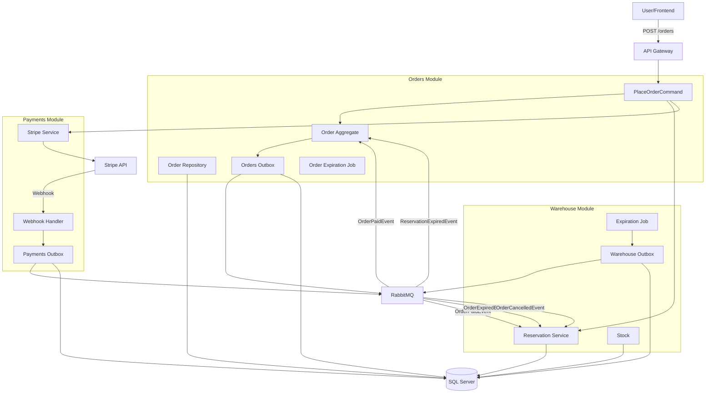
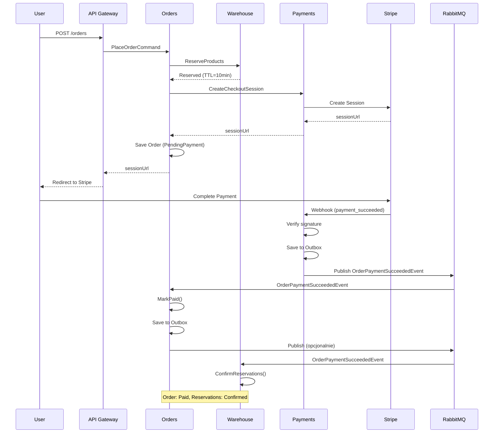
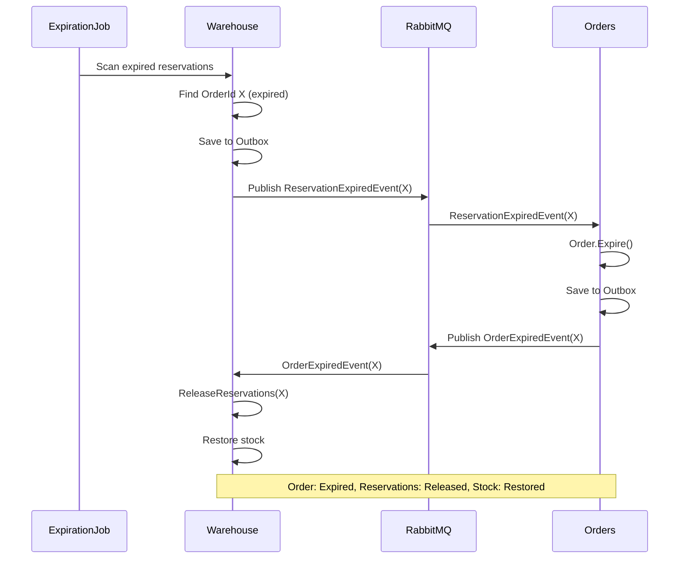

# GuitarStore - Order Flow Implementation Epic

**Data utworzenia:** 2026-03-02
**Typ projektu:** Modular Monolith (.NET 8)
**Cel:** Kompleksowy plan implementacji i poprawy systemu obsługi zamówień eCommerce

---

## Executive Summary

Dokument ten stanowi szczegółowy plan implementacji brakujących funkcjonalności oraz naprawy zidentyfikowanych problemów w systemie obsługi zamówień. Plan został podzielony na **6 głównych partii (Epic)**, które można realizować inkrementalnie.

### Zidentyfikowane problemy krytyczne:

1. **Brak Outbox Pattern** - ryzyko utraty eventów przy awarii RabbitMQ
2. **Brak Optimistic Concurrency** - możliwość last-write-wins przy równoczesnych operacjach
3. **Niepoprawna semantyka eventów** - `OrderCancelledEvent` publikowany przy `payment_failed`
4. **Brak integracji Warehouse z eventami** - rezerwacje nie są potwierdzane/zwalniane
5. **Brak job'a do wygasania zamówień** - tylko rezerwacje wygasają, zamówienia zostają w `PendingPayment`
6. **Brak obsługi anulowania zamówień przez użytkownika**
7. **Brak retry logic i dead letter queue** dla consumerów
8. **Brak monitoringu i observability** dla flow zamówień

---

## Krytyczna Analiza Obecnej Implementacji

### ✅ Co działa dobrze:

1. **Transakcyjność PlaceOrder** - cała operacja w jednej transakcji DB
2. **Idempotencja webhook'ów** - deduplikacja przez `eventId`
3. **Idempotencja domain operations** - `MarkPaid()` jest idempotentna
4. **TTL dla rezerwacji** - mechanizm soft reservation z czasem wygaśnięcia
5. **Walidacja webhook signature** - bezpieczeństwo integracji ze Stripe
6. **Domain-driven design** - czysty model domenowy z biznesową logiką

### ❌ Problemy wymagające naprawy:

#### 1. **Brak Outbox Pattern (KRYTYCZNE)**
- **Problem:** Publikacja do RabbitMQ poza transakcją DB
- **Ryzyko:** Utrata eventów przy awarii; niespójność stanu
- **Lokalizacja:** `StripeWebhookCommandHandler:70-74` (Payments.Core)
- **Wpływ:** Może prowadzić do zamówień opłaconych, ale nieoznaczonych jako `Paid`

#### 2. **Brak Optimistic Concurrency (WYSOKIE)**
- **Problem:** `OrderDbModel` nie ma `RowVersion`/`ConcurrencyToken`
- **Ryzyko:** Last-write-wins przy równoczesnych update'ach
- **Scenariusz:**
  - Handler A: MarkPaid
  - Handler B (równolegle): Expire
  - Jeden nadpisze drugi
- **Lokalizacja:** `OrderDbModel.cs:4-11`

#### 3. **Niepoprawna semantyka eventów (WYSOKIE)**
- **Problem:** `OrderCancelledEvent` publikowany przy `payment_failed`
- **Dlaczego źle:** Payment failure != Order cancellation
  - Payment może być retry'owany
  - Order nie powinien być anulowany po pierwszym błędzie płatności
- **Lokalizacja:** `StripeWebhookCommand.cs:73-74`
- **Rekomendacja:** Wprowadzić `OrderPaymentFailedEvent` (non-terminal)

#### 4. **Brak integracji Warehouse z eventami (WYSOKIE)**
- **Problem:** Warehouse nie subskrybuje żadnych eventów
- **Konsekwencje:**
  - Rezerwacje nie są potwierdzane po `OrderPaidEvent`
  - Rezerwacje nie są zwalniane po `OrderCancelledEvent`
- **Kod istnieje:** `ConfirmReservations()` i `ReleaseReservations()` są zaimplementowane
- **Brakuje:** Event handlers i subscription w Warehouse

#### 5. **Incomplete Expiration Flow (ŚREDNIE)**
- **Problem:** `StockReservationExpirationJob` wygasa tylko rezerwacje magazynowe
- **Brakuje:**
  - Job nie publikuje eventu `ReservationExpired`
  - Orders nie konsumuje tego eventu
  - Zamówienia pozostają w stanie `PendingPayment` mimo wygasłych rezerwacji
- **Lokalizacja:** `StockReservationExpirationJob.cs:32-55`

#### 6. **Brak user cancellation flow (ŚREDNIE)**
- **Problem:** Metoda `Order.Cancel()` istnieje, ale brak endpoint'u i handlera
- **Brakuje:**
  - API endpoint `/orders/{id}/cancel`
  - Command + Handler
  - Publikacja `OrderCancelledEvent` (business decision)
  - Release rezerwacji w Warehouse

#### 7. **Brak error handling w consumers (ŚREDNIE)**
- **Problem:** Consumers nie mają retry logic ani dead letter queue
- **Ryzyko:** Poison messages mogą blokować kolejkę
- **Lokalizacja:** `OrderPaidEventHandler.cs:21-27`

#### 8. **Brak observability (NISKIE, ale ważne)**
- **Problem:** Brak structured logging, correlation ID, trace ID
- **Utrudnia:** Debugging flow'u przez moduły
- **Brakuje:**
  - Correlation ID propagation
  - Metrics (Prometheus/Application Insights)
  - Distributed tracing

#### 9. **Hardcoded TTL (NISKIE)**
- **Problem:** TTL rezerwacji hardcoded `TimeSpan.FromMinutes(10)`
- **Lokalizacja:** `PlaceOrderCommand.cs:60`
- **Powinno być:** Configuration (appsettings.json)

#### 10. **OrderCompletionJob is empty (INFORMACYJNE)**
- **Problem:** Job istnieje ale jest pusty z komentarzami TODO
- **Lokalizacja:** `OrderCompletionJob.cs:34-50`
- **Akcja:** Usunąć lub zaimplementować zgodnie z planem

---

## Rekomendowana Architektura Docelowa

### Order Lifecycle (docelowy):

```
PendingPayment → Paid → Sent → Realized
       ↓           ↓
    Expired    Canceled
```

### Reservation Lifecycle (docelowy):

```
Active → Confirmed
   ↓
Released/Expired
```

### Events Taxonomy (poprawiona):

**Payments Module (payment outcomes):**
- `OrderPaymentSucceededEvent(orderId, paymentIntentId, occurredAtUtc)`
- `OrderPaymentFailedEvent(orderId, paymentIntentId, failureReason, occurredAtUtc)` ← **NOWE**
- `OrderPaymentCanceledEvent(orderId, paymentIntentId, occurredAtUtc)` ← **opcjonalne**

**Orders Module (business decisions):**
- `OrderExpiredEvent(orderId, reason, occurredAtUtc)` ← **NOWE**
- `OrderCancelledEvent(orderId, reason, cancelledBy, occurredAtUtc)` ← **poprawione**
- `OrderReadyForFulfillmentEvent(orderId, occurredAtUtc)` ← **opcjonalne**

**Warehouse Module:**
- `ReservationExpiredEvent(orderId, occurredAtUtc)` ← **NOWE**
- `ReservationConfirmedEvent(orderId, occurredAtUtc)` ← **opcjonalne**
- `ReservationReleasedEvent(orderId, reason, occurredAtUtc)` ← **opcjonalne**

---

## EPIC - Plan Implementacji

Plan podzielony na **6 partii** do sekwencyjnej implementacji.

---

## **PARTIA 1: Foundation - Outbox Pattern & Concurrency**

**Priorytet:** KRYTYCZNY
**Złożoność:** ŚREDNIA
**Czas:** 2-3 dni
**Zależności:** Brak

### Cel:
Wprowadzenie Outbox Pattern dla zapewnienia exactly-once semantics oraz optimistic concurrency dla Order aggregate.

### Zadania:

#### **1.1 Implementacja Outbox Pattern dla Payments Module**

**Kroki:**
1. Utworzyć tabelę `OutboxMessages` w schemacie `Payments`
   ```sql
   CREATE TABLE Payments.OutboxMessages (
       Id UNIQUEIDENTIFIER PRIMARY KEY,
       Type NVARCHAR(255) NOT NULL,
       Payload NVARCHAR(MAX) NOT NULL,
       OccurredOnUtc DATETIME2 NOT NULL,
       ProcessedOnUtc DATETIME2 NULL,
       RetryCount INT NOT NULL DEFAULT 0,
       LastError NVARCHAR(MAX) NULL,
       CorrelationId NVARCHAR(100) NULL
   )
   ```

2. Dodać `DbSet<OutboxMessage>` do `PaymentsDbContext`

3. Zmodyfikować `StripeWebhookCommandHandler`:
   - Zamiast `await integrationEventPublisher.Publish(...)`
   - Zapisać event do tabeli `OutboxMessages` w tej samej transakcji

4. Utworzyć `OutboxMessageDispatcherJob`:
   - Background service (np. co 5-10 sekund)
   - Czyta nieprzetworzoneOutbox messages (`ProcessedOnUtc IS NULL`)
   - Publikuje do RabbitMQ
   - Oznacza jako przetworzone
   - Retry logic z exponential backoff
   - Dead letter po X próbach

**Pliki do modyfikacji:**
- `Payments.Core/Database/PaymentsDbContext.cs`
- `Payments.Core/Commands/StripeWebhookCommand.cs`
- `Payments.Core/Services/OutboxMessageDispatcherJob.cs` ← **NOWY**
- `Payments.Core/Migrations/XXX_AddOutboxMessages.cs` ← **NOWY**

**Testy:**
- Unit test: Webhook zapisuje do outbox zamiast publish
- Integration test: Dispatcher publikuje z outbox do Rabbit
- Integration test: Retry logic przy błędzie publikacji

---

#### **1.2 Dodanie Optimistic Concurrency do Order**

**Kroki:**
1. Dodać `RowVersion` do `OrderDbModel`:
   ```csharp
   [Timestamp]
   public byte[]? RowVersion { get; set; }
   ```

2. Dodać `RowVersion` do `Order` domain model:
   ```csharp
   public byte[]? RowVersion { get; private set; }
   ```

3. Skonfigurować w `OrderConfiguration` (EF):
   ```csharp
   builder.Property(x => x.RowVersion)
          .IsRowVersion();
   ```

4. Obsłużyć `DbUpdateConcurrencyException` w `OrderPaidEventHandler`:
   - Retry (np. 3 próby) z exponential backoff
   - Dead letter jeśli nadal konflikt
   - Logowanie conflict'u

5. Utworzyć migration

**Pliki do modyfikacji:**
- `Orders.Infrastructure/Orders/OrderDbModel.cs`
- `Orders.Domain/Orders/Order.cs`
- `Orders.Infrastructure/Orders/OrderConfiguration.cs`
- `Orders.Application/Orders/Events/Incoming/OrderPaidEventHandler.cs`
- `Orders.Infrastructure/Migrations/XXX_AddRowVersionToOrder.cs` ← **NOWY**

**Testy:**
- Unit test: Concurrency conflict detection
- Integration test: Retry logic przy conflict

---

#### **1.3 Konfiguracja dla TTL rezerwacji**

**Kroki:**
1. Dodać do `appsettings.json`:
   ```json
   "Orders": {
     "ReservationTtlMinutes": 10
   }
   ```

2. Utworzyć `OrdersConfiguration` class:
   ```csharp
   public class OrdersConfiguration {
       public int ReservationTtlMinutes { get; set; }
   }
   ```

3. Zarejestrować w DI

4. Użyć w `PlaceOrderCommandHandler`

**Pliki do modyfikacji:**
- `Orders.Application/Configuration/OrdersConfiguration.cs` ← **NOWY**
- `Orders.Application/ApplicationModule.cs`
- `Orders.Application/Orders/Commands/PlaceOrderCommand.cs`

---

### Definition of Done (Partia 1):
- [ ] Outbox table created w Payments schema
- [ ] Webhook handler zapisuje do outbox zamiast publish
- [ ] OutboxDispatcherJob działa i publikuje eventy
- [ ] RowVersion dodany do Order z konfiguracją EF
- [ ] Retry logic w OrderPaidEventHandler
- [ ] TTL z konfiguracji zamiast hardcoded
- [ ] Unit tests + Integration tests przechodzą
- [ ] Migration scripts działają

---

## **PARTIA 2: Events Refactoring - Proper Semantics**

**Priorytet:** WYSOKI
**Złożoność:** ŚREDNIA
**Czas:** 1-2 dni
**Zależności:** Partia 1

### Cel:
Poprawienie semantyki eventów - rozdzielenie payment outcomes od business decisions.

### Zadania:

#### **2.1 Wprowadzenie OrderPaymentFailedEvent**

**Kroki:**
1. Utworzyć nowy event w Payments:
   ```csharp
   public sealed record OrderPaymentFailedEvent(
       OrderId OrderId,
       string PaymentIntentId,
       string? FailureCode,
       DateTime OccurredAtUtc
   ) : IntegrationEvent, IIntegrationPublishEvent;
   ```

2. Zmodyfikować `StripeWebhookCommandHandler`:
   - Dla `payment_failed` publikować `OrderPaymentFailedEvent` zamiast `OrderCancelledEvent`
   - Zachować `OrderCancelledEvent` tylko dla `payment_intent.canceled` (jeśli w ogóle)

3. Utworzyć handler w Orders module:
   ```csharp
   internal class OrderPaymentFailedEventHandler : IIntegrationEventHandler<OrderPaymentFailedEvent>
   {
       // Logika:
       // - Zalogować failure
       // - Opcjonalnie: store failure info w Order (nowe pole)
       // - NIE zmieniać statusu (Order pozostaje PendingPayment)
       // - Możliwość retry w ramach TTL
   }
   ```

4. Subskrybować event w `EventBusSubscriptionManager`

**Pliki do modyfikacji:**
- `Payments.Core/Events/Outgoing/OrderPaymentFailedEvent.cs` ← **NOWY**
- `Payments.Core/Commands/StripeWebhookCommand.cs`
- `Orders.Application/Orders/Events/Incoming/OrderPaymentFailedEvent.cs` ← **NOWY**
- `Orders.Application/EventBusSubscriptionManager.cs`

**Testy:**
- Unit test: payment_failed → OrderPaymentFailedEvent
- Integration test: Order nie jest anulowany po payment failure
- Integration test: Order może być paid po wcześniejszym failure

---

#### **2.2 Zmiana OrderCancelledEvent na business decision**

**Kroki:**
1. Rozszerzyć `OrderCancelledEvent`:
   ```csharp
   public sealed record OrderCancelledEvent(
       OrderId OrderId,
       string Reason,
       string CancelledBy, // "User", "System", "Admin"
       DateTime OccurredAtUtc
   ) : IntegrationEvent, IIntegrationPublishEvent;
   ```

2. **NIE** publikować tego eventu z Payments (usunąć)

3. Event będzie publikowany tylko przez Orders module w dwóch scenariuszach:
   - User cancellation (Partia 3)
   - Admin cancellation (przyszłość)

**Pliki do modyfikacji:**
- `Payments.Core/Events/Outgoing/OrderCancelledEvent.cs` - **USUNĄĆ**
- `Orders.Application/Orders/Events/Outgoing/OrderCancelledEvent.cs` ← **NOWY** (przenieść do Orders)
- `Payments.Core/Commands/StripeWebhookCommand.cs` - usunąć referencję

---

#### **2.3 Wprowadzenie OrderExpiredEvent**

**Kroki:**
1. Utworzyć event w Orders module:
   ```csharp
   public sealed record OrderExpiredEvent(
       OrderId OrderId,
       string Reason, // "ReservationExpired", "PaymentTimeout"
       DateTime OccurredAtUtc
   ) : IntegrationEvent, IIntegrationPublishEvent;
   ```

2. Event będzie publikowany w Partii 4 (Expiration Job)

**Pliki do utworzenia:**
- `Orders.Application/Orders/Events/Outgoing/OrderExpiredEvent.cs` ← **NOWY**

---

### Definition of Done (Partia 2):
- [ ] `OrderPaymentFailedEvent` utworzony i publikowany
- [ ] Orders handler dla payment failed (non-terminal)
- [ ] `OrderCancelledEvent` przeniesiony do Orders (business decision)
- [ ] Payments NIE publikuje OrderCancelledEvent
- [ ] `OrderExpiredEvent` utworzony (gotowy do użycia)
- [ ] Testy semantyki eventów przechodzą

---

## **PARTIA 3: Warehouse Integration**

**Priorytet:** WYSOKI
**Złożoność:** ŚREDNIA
**Czas:** 2 dni
**Zależności:** Partia 2

### Cel:
Pełna integracja Warehouse z event-driven flow (potwierdzanie i zwalnianie rezerwacji).

### Zadania:

#### **3.1 Warehouse konsumuje OrderPaymentSucceededEvent**

**Kroki:**
1. Utworzyć event handler w Warehouse:
   ```csharp
   internal sealed record OrderPaymentSucceededEvent(OrderId OrderId)
       : IntegrationEvent, IIntegrationConsumeEvent;

   internal sealed class OrderPaymentSucceededEventHandler
       : IIntegrationEventHandler<OrderPaymentSucceededEvent>
   {
       public async Task Handle(OrderPaymentSucceededEvent @event, CancellationToken ct)
       {
           await _reservationService.ConfirmReservations(@event.OrderId, ct);
       }
   }
   ```

2. Utworzyć `EventBusSubscriptionManager` w Warehouse (jeśli nie istnieje)

3. Zarejestrować subscription:
   ```csharp
   _subscriber.Subscribe<OrderPaymentSucceededEvent, OrderPaymentSucceededEventHandler>(
       RabbitMqQueueName.WarehouseQueue
   );
   ```

4. Dodać idempotencję do `ConfirmReservations`:
   - Jeśli już `Confirmed` → no-op
   - Jeśli `Released/Expired` → throw (logika już istnieje)

**Pliki do modyfikacji:**
- `Warehouse.Core/Events/Incoming/OrderPaymentSucceededEvent.cs` ← **NOWY**
- `Warehouse.Core/Events/EventBusSubscriptionManager.cs` ← **NOWY**
- `Warehouse.Core/WarehouseModuleInitializator.cs`
- `Warehouse.Core/InternalModuleApi/ProductReservationService.cs` (idempotencja)

**Testy:**
- Integration test: Payment success → rezerwacje confirmed
- Integration test: Idempotencja (duplikat eventu)
- Integration test: Błąd gdy rezerwacja już expired

---

#### **3.2 Warehouse konsumuje OrderCancelledEvent**

**Kroki:**
1. Utworzyć handler:
   ```csharp
   internal sealed record OrderCancelledEvent(
       OrderId OrderId,
       string Reason,
       string CancelledBy,
       DateTime OccurredAtUtc
   ) : IntegrationEvent, IIntegrationConsumeEvent;

   internal sealed class OrderCancelledEventHandler
       : IIntegrationEventHandler<OrderCancelledEvent>
   {
       public async Task Handle(OrderCancelledEvent @event, CancellationToken ct)
       {
           await _reservationService.ReleaseReservations(@event.OrderId, ct);
       }
   }
   ```

2. Subskrybować

3. Dodać idempotencję do `ReleaseReservations`:
   - Jeśli już `Released/Expired` → no-op
   - Jeśli `Confirmed` → throw lub logowanie (nie powinno się zdarzyć)

**Pliki do modyfikacji:**
- `Warehouse.Core/Events/Incoming/OrderCancelledEvent.cs` ← **NOWY**
- `Warehouse.Core/Events/EventBusSubscriptionManager.cs`
- `Warehouse.Core/InternalModuleApi/ProductReservationService.cs` (idempotencja)

**Testy:**
- Integration test: Order cancelled → rezerwacje released
- Integration test: Stock restored po release

---

#### **3.3 Warehouse konsumuje OrderExpiredEvent**

**Kroki:**
1. Utworzyć handler (analogicznie do OrderCancelledEvent):
   ```csharp
   internal sealed class OrderExpiredEventHandler
       : IIntegrationEventHandler<OrderExpiredEvent>
   {
       public async Task Handle(OrderExpiredEvent @event, CancellationToken ct)
       {
           await _reservationService.ReleaseReservations(@event.OrderId, ct);
       }
   }
   ```

2. Subskrybować

**Pliki do modyfikacji:**
- `Warehouse.Core/Events/Incoming/OrderExpiredEvent.cs` ← **NOWY**
- `Warehouse.Core/Events/EventBusSubscriptionManager.cs`

**Testy:**
- Integration test: Order expired → rezerwacje released

---

#### **3.4 Opcjonalnie: Warehouse publikuje własne eventy**

**Jeśli chcesz większą granularność:**

1. `ReservationConfirmedEvent(orderId, products, confirmedAtUtc)` ← **OPCJONALNE**
2. `ReservationReleasedEvent(orderId, reason, releasedAtUtc)` ← **OPCJONALNE**

Użycie:
- Analytics
- Audit log
- Notyfikacje

**Decyzja:** Odłożyć do późniejszego stadium (nie krytyczne)

---

### Definition of Done (Partia 3):
- [ ] Warehouse konsumuje `OrderPaymentSucceededEvent`
- [ ] Warehouse konsumuje `OrderCancelledEvent`
- [ ] Warehouse konsumuje `OrderExpiredEvent`
- [ ] Rezerwacje są potwierdzane po payment success
- [ ] Rezerwacje są zwalniane po cancel/expire
- [ ] Stock jest przywracany po release
- [ ] Idempotencja działań w Warehouse
- [ ] Integration tests dla całego flow

---

## **PARTIA 4: Expiration Flow - Jobs & Events**

**Priorytet:** WYSOKI
**Złożoność:** ŚREDNIA
**Czas:** 2 dni
**Zależności:** Partia 2, 3
**Status:** ✅ COMPLETED

### Cel:
Kompletny flow wygasania zamówień i rezerwacji z TTL synchronizacją.

### Decyzje architektoniczne:

**Podejście:** Orders module jest master - zarządza wygasaniem zamówień
- `OrderExpirationJob` w Orders wykrywa wygasłe zamówienia (ExpiresAtUtc < now)
- Orders publikuje `OrderExpiredEvent` (business decision)
- Warehouse konsumuje `OrderExpiredEvent` i zwalnia rezerwacje
- `StockReservationExpirationJob` pozostaje jako **safety net** (defensive programming)

**Synchronizacja TTL:**
- `OrdersConfiguration.ReservationTtlMinutes` = single source of truth
- Order.ExpiresAtUtc i Reservation.ExpiresAtUtc wygasają w tym samym momencie
- Wyeliminowano hardcoded values

---

### Zadania:

#### **4.1 Usunięcie hardcoded TTL z Order.Create()** ✅

**Implementacja:**
1. Dodano `ExpiresAtUtc` property do `Order.cs`:
   ```csharp
   public DateTime ExpiresAtUtc { get; }
   ```

2. Zmodyfikowano `Order.Create()` aby przyjmować TTL:
   ```csharp
   public static Order Create(..., TimeSpan timeToLive)
   {
       var expiresAtUtc = DateTime.UtcNow.Add(timeToLive);
       return new Order(..., expiresAtUtc);
   }
   ```

3. Zaktualizowano `PlaceOrderCommand` aby przekazywać TTL z konfiguracji:
   ```csharp
   var reservationTtl = TimeSpan.FromMinutes(_configuration.ReservationTtlMinutes);
   var newOrder = Order.Create(..., timeToLive: reservationTtl);
   await _productReservationService.ReserveProducts(..., reservationTtl);
   ```

**Pliki zmodyfikowane:**
- `Orders.Domain/Orders/Order.cs` (line 16, 44-47)
- `Orders.Application/Orders/Commands/PlaceOrderCommand.cs` (line 58-65)

---

#### **4.2 ExpiresAtUtc w bazie danych** ✅

**Implementacja:**
1. Dodano `ExpiresAtUtc` do `OrderDbModel.cs`:
   ```csharp
   public DateTime ExpiresAtUtc { get; set; }
   ```

2. Skonfigurowano w EF Core (`OrderDbConfiguration.cs`):
   ```csharp
   builder.Property(x => x.ExpiresAtUtc).IsRequired();
   ```

3. Zaktualizowano `OrderRepository` aby zapisywać/odczytywać ExpiresAtUtc

4. Utworzono migration: `20260306215459_AddExpiresAtUtcToOrder`

**Pliki zmodyfikowane:**
- `Orders.Infrastructure/Orders/OrderDbModel.cs` (line 12)
- `Orders.Infrastructure/Orders/OrderDbConfiguration.cs` (line 23)
- `Orders.Infrastructure/Orders/OrderRepository.cs` (line 39, 53)
- `Orders.Infrastructure/Migrations/20260306215459_AddExpiresAtUtcToOrder.cs` ← **NOWY**

---

#### **4.3 OrderExpirationJob** ✅

**Implementacja:**
1. Utworzono `OrderExpirationJob` jako `BackgroundService`:
   - Uruchamia się co 1 minutę
   - Znajduje Orders z statusem `PendingPayment` gdzie `ExpiresAtUtc < DateTime.UtcNow`
   - Dla każdego wygasłego:
     - `order.Expire()` → Status = Expired
     - Publikuje `OrderExpiredEvent(orderId, "PaymentTimeout", DateTime.UtcNow)`

2. Utworzono `GetExpiredPendingPaymentOrders()` w repository:
   ```csharp
   public async Task<IReadOnlyCollection<Order>> GetExpiredPendingPaymentOrders(CancellationToken ct)
   {
       var now = DateTime.UtcNow;
       var dbOrders = await _dbContext.Orders
           .Where(x => x.ExpiresAtUtc < now)
           .ToListAsync(ct);
       // Deserialize and filter by Status == PendingPayment
   }
   ```

3. Zarejestrowano jako Hosted Service w `ApplicationModule`

**Pliki utworzone/zmodyfikowane:**
- `Orders.Application/Orders/BackgroundJobs/OrderExpirationJob.cs` ← **NOWY**
- `Orders.Domain/Orders/IOrderRepository.cs` (line 9)
- `Orders.Infrastructure/Orders/OrderRepository.cs` (line 57-76)
- `Orders.Application/ApplicationModule.cs` (line 40)

**Logowanie:**
```
info: Orders.Application.Orders.BackgroundJobs.OrderExpirationJob[0]
      OrderExpirationJob started.
```

---

#### **4.4 Warehouse konsumuje OrderExpiredEvent** ✅

**Już zaimplementowane w Partii 3.3:**
- `Warehouse.Core/Events/Incoming/OrderExpiredEvent.cs`
- `OrderExpiredEventHandler` → `ReleaseReservations(orderId)`
- Rezerwacje są zwalniane, stock przywracany

**Brak dodatkowych zmian wymaganych.**

---

#### **4.5 StockReservationExpirationJob jako Safety Net** ✅

**Decyzja:** Pozostawić istniejący `StockReservationExpirationJob` jako backup
- Jeśli z jakiegoś powodu `OrderExpirationJob` nie wykryje wygasłego zamówienia
- Warehouse sam wyczyści swoje rezerwacje po TTL
- Defensive programming - redundancja chroni przed bugami

**TODO już istnieje w kodzie:**
```csharp
// TODO: Replace with distributed job mechanism (Hangfire / distributed lock)
// TODO: if application is scaled to multiple instances.
```

---

### Flow wygasania:

```
T=0:     PlaceOrder
         → Order (ExpiresAtUtc = T+10min, Status = PendingPayment)
         → Reservation (ExpiresAtUtc = T+10min, Status = Active)

T=10min: OrderExpirationJob (co 1 min)
         → Finds expired Order (ExpiresAtUtc < now, Status = PendingPayment)
         → order.Expire() → Status = Expired
         → Publish OrderExpiredEvent("PaymentTimeout")

T=10min: Warehouse.OrderExpiredEventHandler
         → ReleaseReservations(orderId)
         → Reservation: Active → Released
         → Stock quantity restored

T=10min: StockReservationExpirationJob (safety net, co 1 min)
         → Finds expired Reservation (ExpiresAtUtc < now, Status = Active)
         → ExpireReservation() → Status = Expired
         → Stock quantity restored (if not already released)
```

---

### Synchronizacja TTL:

**Konfiguracja (single source of truth):**
```json
{
  "Orders": {
    "ReservationTtlMinutes": 10
  }
}
```

**Używana w:**
1. `Order.Create(timeToLive)` → `Order.ExpiresAtUtc = DateTime.UtcNow + TTL`
2. `ReserveProducts(dto)` → `Reservation.ExpiresAtUtc = DateTime.UtcNow + TTL`

**Rezultat:** Oba wygasają w identycznym momencie ✅

---

### Definition of Done (Partia 4):
- [x] TTL usunięty z hardcoded values
- [x] Order.ExpiresAtUtc w domenie i bazie danych
- [x] Migration dla ExpiresAtUtc utworzona
- [x] OrderExpirationJob utworzony i zarejestrowany
- [x] GetExpiredPendingPaymentOrders w repository
- [x] Orders publikuje OrderExpiredEvent (business decision)
- [x] Warehouse konsumuje OrderExpiredEvent → zwalnia rezerwacje
- [x] StockReservationExpirationJob pozostaje jako safety net
- [x] TTL synchronizacja: Order i Reservation wygasają w tym samym momencie
- [x] Build successful, job uruchomiony

---

## **PARTIA 5: User Cancellation Flow**

**Priorytet:** ŚREDNI
**Złożoność:** NISKA
**Czas:** 1 dzień
**Zależności:** Partia 3

### Cel:
Umożliwienie użytkownikowi anulowania zamówienia przed wysyłką.

### Zadania:

#### **5.1 API Endpoint dla anulowania zamówienia**

**Kroki:**
1. Utworzyć command:
   ```csharp
   public sealed record CancelOrderCommand(
       OrderId OrderId,
       CustomerId CustomerId, // z JWT
       string? Reason
   ) : ICommand;
   ```

2. Utworzyć handler:
   ```csharp
   internal sealed class CancelOrderCommandHandler : ICommandHandler<CancelOrderCommand>
   {
       public async Task Handle(CancelOrderCommand command, CancellationToken ct)
       {
           var order = await _orderRepository.Get(command.OrderId, ct);

           // Authorization check
           if (order.CustomerId != command.CustomerId)
               throw new ForbiddenException();

           order.Cancel(); // Throws if Paid/Sent/Realized
           await _orderRepository.Update(order, ct);
           await _unitOfWork.SaveChangesAsync(ct);

           // Publish business event
           await _eventPublisher.Publish(
               new OrderCancelledEvent(
                   command.OrderId,
                   command.Reason ?? "User cancellation",
                   "User",
                   DateTime.UtcNow
               ),
               ct
           );
       }
   }
   ```

3. Utworzyć endpoint w ApiGateway:
   ```csharp
   [HttpPost("api/orders/{orderId:guid}/cancel")]
   [Authorize]
   public async Task<IActionResult> CancelOrder(Guid orderId, [FromBody] CancelOrderRequest request)
   {
       var customerId = GetCustomerIdFromClaims();
       await _mediator.Send(new CancelOrderCommand(new OrderId(orderId), customerId, request.Reason));
       return Ok();
   }
   ```

**Pliki do utworzenia:**
- `Orders.Application/Orders/Commands/CancelOrderCommand.cs` ← **NOWY**
- `GuitarStore.ApiGateway/Controllers/OrdersController.cs` - dodać endpoint

**Testy:**
- Unit test: Cancel order in PendingPayment
- Unit test: Cannot cancel Paid order (DomainException)
- Integration test: Cancel → OrderCancelledEvent → Warehouse releases
- E2E test: User cancels order via API

---

#### **5.2 Frontend integration (out of scope)**

Jeśli masz frontend:
- Przycisk "Anuluj zamówienie" dla statusu `PendingPayment`
- Potwierdzenie dialogowe
- Call do API

---

### Definition of Done (Partia 5):
- [ ] `CancelOrderCommand` + Handler utworzone
- [ ] API endpoint `/orders/{id}/cancel` działa
- [ ] Authorization check (user może anulować tylko swoje)
- [ ] `OrderCancelledEvent` publikowany
- [ ] Warehouse zwalnia rezerwacje
- [ ] Testy jednostkowe i integracyjne
- [ ] E2E test user cancellation flow

---

## **PARTIA 6: Resilience & Observability**

**Priorytet:** ŚREDNI
**Złożoność:** ŚREDNIA-WYSOKA
**Czas:** 3-4 dni
**Zależności:** Wszystkie poprzednie partie

### Cel:
Dodanie retry logic, dead letter queue, correlation ID, metrics i structured logging.

### Zadania:

#### **6.1 Retry Logic dla Event Handlers**

**Kroki:**
1. Wykorzystać MassTransit retry policies lub własny decorator pattern:
   ```csharp
   public class RetryEventHandlerDecorator<TEvent> : IIntegrationEventHandler<TEvent>
   {
       private readonly IIntegrationEventHandler<TEvent> _inner;
       private readonly int _maxRetries = 3;

       public async Task Handle(TEvent @event, CancellationToken ct)
       {
           for (int i = 0; i < _maxRetries; i++)
           {
               try
               {
                   await _inner.Handle(@event, ct);
                   return;
               }
               catch (DbUpdateConcurrencyException) when (i < _maxRetries - 1)
               {
                   await Task.Delay(TimeSpan.FromSeconds(Math.Pow(2, i)), ct);
               }
               catch (Exception ex)
               {
                   _logger.LogError(ex, "Handler failed, attempt {Attempt}", i + 1);
                   if (i == _maxRetries - 1)
                       throw; // Dead letter
               }
           }
       }
   }
   ```

2. Zarejestrować decorator w DI

3. Skonfigurować RabbitMQ dead letter exchange

**Pliki do modyfikacji:**
- `Common.RabbitMq/Decorators/RetryEventHandlerDecorator.cs` ← **NOWY**
- `Common.RabbitMq/Extensions/RabbitMqExtension.cs`
- `appsettings.json` - konfiguracja retry policy

**Testy:**
- Unit test: Retry on transient failure
- Integration test: Dead letter po max retries

---

#### **6.2 Correlation ID Propagation**

**Kroki:**
1. Dodać `CorrelationId` do `IntegrationEvent`:
   ```csharp
   public abstract record IntegrationEvent
   {
       public Guid EventId { get; init; } = Guid.NewGuid();
       public DateTime OccurredAtUtc { get; init; } = DateTime.UtcNow;
       public string? CorrelationId { get; init; } // ← NOWE
   }
   ```

2. Propagować correlation ID:
   - Od HTTP request → PlaceOrderCommand
   - Od PlaceOrder → Stripe session metadata
   - Od webhook → events
   - Przez kolejne eventy

3. Wykorzystać w logowaniu:
   ```csharp
   _logger.LogInformation("Processing {@Event} [CorrelationId: {CorrelationId}]",
       @event, @event.CorrelationId);
   ```

**Pliki do modyfikacji:**
- `Common.RabbitMq.Abstractions/Events/IntegrationEvent.cs`
- Wszystkie handlery - dodać correlation ID do logu
- `PlaceOrderCommandHandler.cs` - propagacja do Stripe metadata

**Testy:**
- Integration test: Correlation ID propagation through flow

---

#### **6.3 Structured Logging z Serilog**

**Kroki:**
1. Zainstalować Serilog + sinks (Console, Seq, Application Insights)

2. Skonfigurować w `Program.cs`:
   ```csharp
   Log.Logger = new LoggerConfiguration()
       .Enrich.FromLogContext()
       .Enrich.WithProperty("Application", "GuitarStore")
       .WriteTo.Console(new JsonFormatter())
       .WriteTo.Seq("http://localhost:5341")
       .CreateLogger();
   ```

3. Logować w kluczowych miejscach:
   - `PlaceOrderCommandHandler` - order placed
   - `StripeWebhookCommandHandler` - webhook received
   - Event handlers - event processed
   - Jobs - expiration detected

4. Używać structured properties:
   ```csharp
   _logger.LogInformation(
       "Order placed: {OrderId}, Customer: {CustomerId}, Total: {Total}",
       order.Id, order.CustomerId, order.TotalPrice
   );
   ```

**Pliki do modyfikacji:**
- `GuitarStore.ApiGateway/Program.cs`
- Wszystkie handlery - dodać structured logging
- `appsettings.json` - Serilog configuration

---

#### **6.4 Metrics & Monitoring**

**Kroki:**
1. Dodać Application Insights lub Prometheus

2. Metrics do śledzenia:
   - `orders_placed_total` (counter)
   - `orders_paid_total` (counter)
   - `orders_expired_total` (counter)
   - `orders_cancelled_total` (counter)
   - `reservations_active` (gauge)
   - `webhook_processing_duration` (histogram)
   - `event_handler_duration` (histogram)

3. Użyć `System.Diagnostics.Metrics` (.NET 8):
   ```csharp
   private static readonly Counter<int> OrdersPlaced =
       Meter.CreateCounter<int>("orders_placed_total");

   // W handlerze:
   OrdersPlaced.Add(1, new KeyValuePair<string, object?>("status", "pending_payment"));
   ```

4. Skonfigurować export do Prometheus/AppInsights

**Pliki do modyfikacji:**
- `Common/Telemetry/Metrics.cs` ← **NOWY**
- Wszystkie handlery - dodać metrics
- `Program.cs` - configure OpenTelemetry

---

#### **6.5 Health Checks**

**Kroki:**
1. Dodać health checks:
   - Database connectivity (Orders, Warehouse, Payments)
   - RabbitMQ connectivity
   - Stripe API availability (opcjonalnie)

2. Endpoint `/health`:
   ```csharp
   builder.Services.AddHealthChecks()
       .AddDbContextCheck<OrdersDbContext>("orders-db")
       .AddDbContextCheck<WarehouseDbContext>("warehouse-db")
       .AddDbContextCheck<PaymentsDbContext>("payments-db")
       .AddRabbitMQ("rabbitmq");

   app.MapHealthChecks("/health");
   ```

**Pliki do modyfikacji:**
- `GuitarStore.ApiGateway/Program.cs`

---

### Definition of Done (Partia 6):
- [ ] Retry logic w event handlers
- [ ] Dead letter queue skonfigurowane
- [ ] Correlation ID propagowane przez flow
- [ ] Structured logging z Serilog
- [ ] Metrics zbierane i exportowane
- [ ] Health checks endpoint działa
- [ ] Dashboard w Seq/Grafana (opcjonalnie)

---

## Dodatkowe Rekomendacje (Backlog)

### 1. **Saga Pattern dla złożonych flow**
- Jeśli flow stanie się bardziej skomplikowane (np. integracja z external shipping API)
- Rozważyć MassTransit Saga lub własną implementację

### 2. **CQRS Read Models**
- Rozdzielić read models dla różnych use case'ów
- `OrderListReadModel`, `OrderDetailsReadModel`
- Materialized views lub projection handlers

### 3. **Event Sourcing (długoterminowo)**
- Dla Order aggregate można rozważyć Event Sourcing
- Pełna historia zmian statusu
- Replay capability

### 4. **API Versioning**
- Wprowadzić versioning dla API (`/api/v1/orders`)
- Pozwoli na breaking changes w przyszłości

### 5. **Rate Limiting**
- Dla endpoint'ów publicznych (PlaceOrder, CancelOrder)
- Ochrona przed abuse

### 6. **Admin Panel**
- Endpoint do manualnego anulowania zamówień przez admina
- Endpoint do manualnego wygaszania rezerwacji
- Audit log akcji adminów

### 7. **Notifications**
- Email/SMS notifications:
  - Order placed
  - Payment confirmed
  - Order shipped
  - Order expired/cancelled
- Osobny Notifications module

### 8. **Fulfillment Flow (Sent → Realized)**
- Integracja z Delivery module
- `MarkSent` endpoint (po wysłaniu paczki)
- `MarkRealized` endpoint/event (po dostawie)

### 9. **Performance Optimization**
- Caching dla read models (Redis)
  - Cache order details
  - Cache stock availability
- Bulk operations dla rezerwacji

### 10. **Security Hardening**
- HTTPS tylko
- API Key dla webhook'ów (dodatkowo do Stripe signature)
- Authorization policies (policy-based authorization)
- Input validation z FluentValidation

---

## Podsumowanie Priorytetów

### Must Have (Krytyczne):
1. **Partia 1** - Outbox Pattern & Concurrency ✅
2. **Partia 2** - Events Refactoring ✅
3. **Partia 3** - Warehouse Integration ✅
4. **Partia 4** - Expiration Flow ✅

### Should Have (Ważne):
5. **Partia 5** - User Cancellation ✅
6. **Partia 6** - Resilience & Observability (częściowo)

### Nice to Have (Backlog):
- Admin panel
- Notifications
- Event Sourcing
- Advanced metrics

---

## Metryki Sukcesu

### Funkcjonalne:
- [ ] Order może przejść przez cały lifecycle: Pending → Paid → Sent → Realized
- [ ] Order może być anulowany przez usera (gdy Pending)
- [ ] Order automatycznie wygasa po TTL
- [ ] Rezerwacje są potwierdzane po payment success
- [ ] Rezerwacje są zwalniane po cancel/expire
- [ ] Stock jest przywracany po release rezerwacji
- [ ] Brak data loss przy awarii RabbitMQ (Outbox)
- [ ] Brak race conditions przy concurrent updates (Optimistic Concurrency)

### Niefunkcjonalne:
- [ ] 99.9% success rate dla PlaceOrder
- [ ] < 500ms p95 latency dla PlaceOrder
- [ ] Brak poison messages w kolejkach
- [ ] Correlation ID w 100% requestów
- [ ] Health checks działają
- [ ] Metrics są zbierane

---

## Szacowany Czas Realizacji

| Partia | Złożoność | Czas | Dev Days |
|--------|-----------|------|----------|
| 1 - Foundation | Średnia | 2-3 dni | 3 |
| 2 - Events Refactoring | Średnia | 1-2 dni | 2 |
| 3 - Warehouse Integration | Średnia | 2 dni | 2 |
| 4 - Expiration Flow | Średnia | 2 dni | 2 |
| 5 - User Cancellation | Niska | 1 dzień | 1 |
| 6 - Resilience | Średnia-Wysoka | 3-4 dni | 4 |
| **TOTAL** | | **11-14 dni** | **14** |

**Note:** To są developer days, zakładając full-time focus. W realnym projekcie (PR reviews, meetings, etc.) × 1.5-2.

---

## Strategia Wdrożenia

### Krok 1: Przygotowanie
- Code review obecnej implementacji
- Setup środowiska dev/test
- Przygotowanie branchy feature

### Krok 2: Implementacja Inkrementalna
- Każda partia = osobny epic w Jira/Azure DevOps
- Każde zadanie = osobny PR
- Code review obowiązkowe
- Testy jednostkowe + integracyjne + E2E

### Krok 3: Testing
- Integration tests dla każdej partii
- E2E test całego flow po każdej partii
- Performance testing (opcjonalnie)

### Krok 4: Deployment
- Deploy do środowiska testowego po każdej partii
- Smoke tests
- Deploy do produkcji po zakończeniu Partii 4 (minimum viable)

### Krok 5: Monitoring
- Śledzenie metrics w produkcji
- Alerty dla błędów
- Retrospektywa po każdej partii

---

## Załączniki

### A. Diagram Architektury Docelowej



### B. Sequence Diagram - Happy Path



### C. Sequence Diagram - Expiration Path



---

## Kontakt & Feedback

Ten dokument jest living document. Proszę o feedback i aktualizacje w miarę postępu implementacji.

**Przygotowane przez:** Claude (Senior .NET Developer & Software Architect)
**Data:** 2026-03-02
**Wersja:** 1.0
