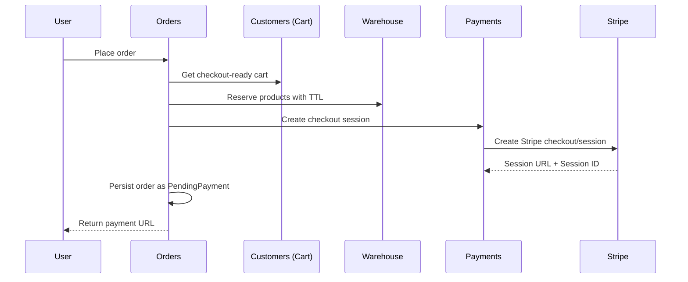
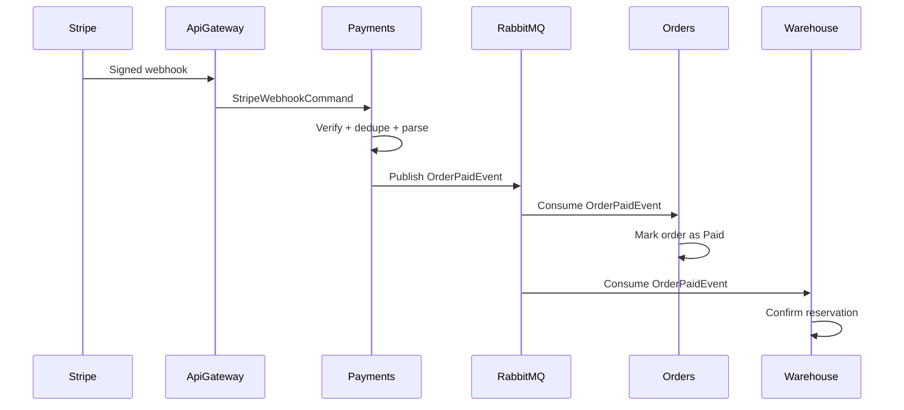
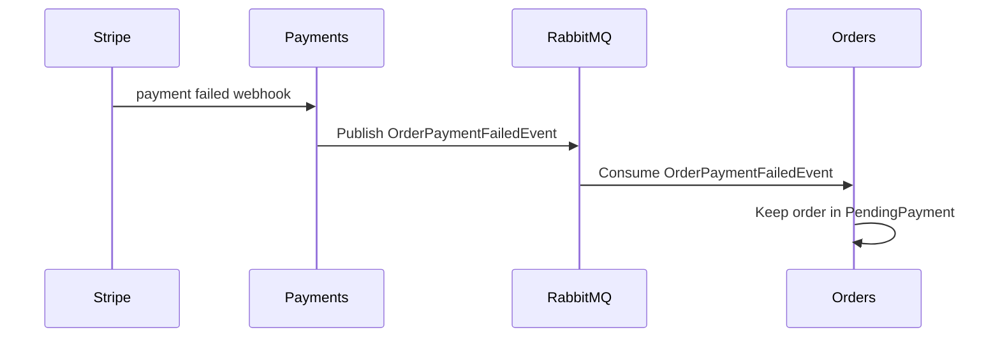
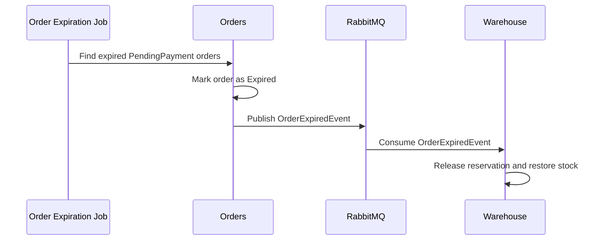

# GuitarStore - Orders Architecture

**Context:** modular monolith (.NET 8), single MSSQL database with schema-per-module, RabbitMQ integration events, Stripe checkout + webhooks.

**Goal:** define the target and governing architecture of the order domain in GuitarStore, including lifecycle, module responsibilities, consistency model, event contracts, failure handling, and extension boundaries.

---

## 1. Architectural Role of the Orders Domain

The `Orders` domain is responsible for:
- creating orders from checkout data,
- owning the order lifecycle,
- coordinating payment-driven and expiration-driven state transitions,
- exposing order status and order history to customer-facing APIs,
- publishing business decisions that other modules react to.

`Orders` is the source of truth for:
- order state,
- order identity,
- order ownership,
- expiration of unpaid orders.

`Orders` is not the source of truth for:
- cart content,
- payment processing internals,
- stock quantities and reservation persistence,
- delivery execution internals.

---

## 2. Module Responsibilities and Boundaries

### Orders

Responsible for:
- building an `Order` from checkout data,
- persisting the aggregate,
- transitioning the order through its lifecycle,
- deciding when an order is `Canceled` or `Expired`,
- reacting to payment outcome events.

### Customers

Responsible for:
- customer-owned cart state,
- checkout preparation data,
- delivery input needed to place an order.

Orders reads checkout-ready data from `Customers`.

### Warehouse

Responsible for:
- stock state,
- stock reservations with TTL,
- confirming reservations after successful payment,
- releasing reservations after cancellation or expiration.

Warehouse does not own the order lifecycle.

### Payments

Responsible for:
- Stripe checkout/session creation,
- Stripe webhook verification and parsing,
- idempotent webhook processing,
- publishing payment outcome events.

Payments does not decide whether an order is canceled or expired as a business outcome.

### ApiGateway

Responsible for:
- exposing HTTP endpoints,
- orchestrating request entry into the application layer,
- hosting the future auth UI,
- eventually enforcing authenticated ownership at the API boundary.

---

## 3. Core Architectural Principles

### 3.1 Orders Own the Lifecycle

The order aggregate is the canonical source of lifecycle state.

Warehouse may expire reservations and Payments may detect payment outcomes, but business-level order state is decided in `Orders`.

### 3.2 First Persisted Order State Is `PendingPayment`

Orders are created as immediately payment-oriented entities:
- stock is reserved,
- Stripe checkout is started,
- the first persisted business state is `PendingPayment`.

There is no architectural requirement for a persisted pre-checkout `Draft` or `New` state in the current model.

### 3.3 Payment Failure Is Not Automatic Cancellation

Payment outcome and order business decision are separate concepts.

This means:
- successful payment transitions an order toward `Paid`,
- failed payment is non-terminal by default,
- explicit cancellation and expiration remain separate business outcomes.

### 3.4 Warehouse Reservations Are Supporting State

Reservations protect stock and support payment flow, but they do not replace the order lifecycle.

The order is the business object.
The reservation is a supporting operational object.

### 3.5 Reliability Is Built Around Idempotency and Event Safety

The architecture assumes:
- at-least-once webhook delivery,
- at-least-once integration message delivery,
- possible duplicates,
- possible reordering,
- transient infrastructure failures.

Therefore:
- webhook handling must be idempotent,
- domain transitions must be safe against repeated events,
- integration publication must avoid silent loss,
- concurrent writes must not degrade into uncontrolled last-write-wins.

---

## 4. Canonical Order Lifecycle

The governing lifecycle is:

- `PendingPayment`
- `Paid`
- `Sent`
- `Realized`
- `Canceled`
- `Expired`

### `PendingPayment`

Meaning:
- the order has been created,
- stock has been reserved,
- the system is waiting for payment confirmation.

This is the first persisted state.

### `Paid`

Meaning:
- payment has been successfully confirmed,
- the order is ready for fulfillment,
- reservation should be confirmed in Warehouse.

### `Sent`

Meaning:
- fulfillment or shipment has started.

### `Realized`

Meaning:
- the order has been completed and delivered.

### `Canceled`

Meaning:
- the order has been canceled before fulfillment.

### `Expired`

Meaning:
- payment was not completed before the allowed reservation/payment time window elapsed.

---

## 5. Reservation Lifecycle in Warehouse

The reservation lifecycle is:
- `Active`
- `Confirmed`
- `Released`
- optionally explicit `Expired` in warehouse internals if needed

Interpretation:
- `Active`: reservation exists and TTL is running,
- `Confirmed`: payment succeeded and reservation is finalized,
- `Released`: reservation was removed because the order was canceled or expired.

Architecturally, `Orders` owns the business decision.
`Warehouse` owns the stock-side execution.

---

## 6. Consistency Model

### 6.1 Synchronous Request Path

Order placement is designed as a synchronous, application-level orchestration across modules:
- read checkout data,
- validate order input,
- reserve stock,
- create Stripe checkout/session,
- persist the order.

Because the system is a modular monolith with one MSSQL database, atomicity inside the request path is achieved through shared database transaction mechanisms.

### 6.2 Asynchronous Integration Path

After the request completes, cross-module reactions are driven through integration events.

This path is intentionally asynchronous because:
- webhook delivery is asynchronous,
- payment confirmation is asynchronous,
- stock confirmation and release should remain decoupled from the HTTP request path.

### 6.3 Reliability Boundaries

The architecture relies on:
- idempotent webhook processing in `Payments`,
- integration events via RabbitMQ,
- outbox-style durability for payment-driven event publication,
- optimistic concurrency for `Order` persistence.

These mechanisms prevent:
- silent message loss,
- duplicate business transitions,
- race-condition overwrites during concurrent handlers/jobs.

---

## 7. Event Taxonomy

### 7.1 Payment Outcome Events

Produced by `Payments`, consumed by `Orders` and/or `Warehouse`.

Current architectural contracts:
- `OrderPaidEvent`
- `OrderPaymentFailedEvent`

Semantics:
- `OrderPaidEvent` means payment is confirmed,
- `OrderPaymentFailedEvent` means a payment attempt failed and the order remains non-terminal unless a separate business decision is made.

### 7.2 Order Business Decision Events

Produced by `Orders`.

Current architectural contracts:
- `OrderCancelledEvent`
- `OrderExpiredEvent`

Semantics:
- `OrderCancelledEvent` is a business cancellation decision,
- `OrderExpiredEvent` is an expiration decision taken by the order domain.

### 7.3 Why This Separation Matters

The architecture intentionally separates:
- external payment outcomes,
- internal business decisions.

This prevents conflating:
- "payment attempt failed"
with
- "the order is terminally canceled".

That distinction is essential for:
- retries,
- correct state transitions,
- out-of-order event tolerance,
- cleaner ownership between modules.

---

## 8. Webhook and Payment Architecture

### 8.1 Stripe Webhook Handling

Stripe webhooks are treated as:
- externally triggered,
- at-least-once,
- potentially duplicated,
- potentially delayed.

Therefore the payment architecture requires:
- signature verification,
- TTL/recency validation when applicable,
- deduplication by Stripe event identifier,
- safe parsing of order identity from metadata,
- durable publication of payment outcome events.

### 8.2 Payment Outcome Processing

After successful webhook validation:
- `Payments` records processing state,
- payment outcome is transformed into an integration event,
- downstream modules react asynchronously.

`Orders` reacts to payment success by moving from `PendingPayment` to `Paid`.

`Warehouse` reacts to payment success by confirming reservation state.

---

## 9. Expiration Architecture

### 9.1 Orders Are the Expiration Decider

The governing architecture is:
- `Orders` decides when an unpaid order has expired,
- `Warehouse` reacts by releasing stock reservations.

This preserves the rule that the order lifecycle belongs to `Orders`.

### 9.2 Background Processing

Expiration is enforced by background processing rather than passive time checks on reads.

The intended behavior is:
- unpaid orders past `ExpiresAtUtc` are detected,
- order state transitions to `Expired`,
- `OrderExpiredEvent` is published,
- Warehouse releases reservations.

### 9.3 Safety-Net Reservation Expiration

Warehouse-side expiration handling may still exist as a defensive fallback.

Architecturally:
- `Orders` remains the business owner of expiration,
- Warehouse fallback expiration protects stock consistency if an order-side flow is delayed or disrupted.

---

## 10. Concurrency Model

Orders are stored as serialized snapshots, so uncontrolled concurrent updates would be dangerous.

The architecture therefore requires optimistic concurrency via row-versioning.

This protects flows such as:
- payment success arriving near expiration,
- cancellation racing with payment outcome,
- repeated event handling across retries.

Expected behavior:
- conflicting updates are detected,
- retries or controlled failure handling are used instead of silent overwrite.

---

## 11. Failure Semantics

### 11.1 Place Order Failures

Examples:
- invalid delivery input,
- insufficient stock,
- Stripe checkout/session creation failure,
- DB transaction failure.

Architectural consequence:
- failed order placement must not leave partially persisted business state.

### 11.2 Webhook Failures

Examples:
- invalid signature,
- duplicate event,
- stale event,
- temporary infra failure,
- transient publication failure.

Architectural consequence:
- only failures that should be retried by infrastructure should surface as operational failure,
- duplicates and stale events should be safe no-ops,
- business correctness must not depend on exactly-once delivery from Stripe or RabbitMQ.

---

## 12. End-to-End Flows

### 12.1 Place Order

### 12.2 Payment Success

### 12.3 Payment Failure

### 12.4 Order Expiration

---

## 13. Extension Points

The architecture intentionally leaves room for:
- richer fulfillment workflows after `Paid`,
- notifications,
- operational/admin actions,
- stronger distributed scheduling guarantees,
- expanded read models and reporting,
- more advanced observability and rate limiting.

These do not change the core architectural rule set:
- `Orders` owns lifecycle,
- `Payments` owns payment interaction,
- `Warehouse` owns reservation/stock execution,
- integration remains idempotent and event-driven.

---

## 14. Architectural Summary

The governing architecture of order handling in GuitarStore is:
- order-centric,
- event-driven across modules,
- transactionally safe in the synchronous placement path,
- idempotent in asynchronous payment and expiration paths,
- explicit about ownership boundaries between `Orders`, `Payments`, `Warehouse`, and `Customers`.

This architecture is designed to support a realistic e-commerce flow while remaining appropriate for a modular-monolith educational project.
